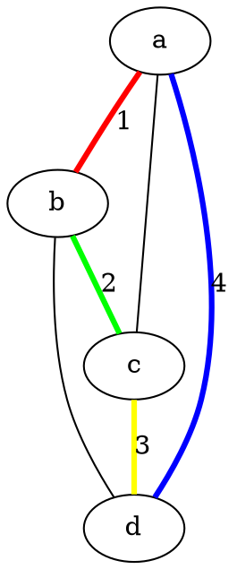

# tests_hackmd

### Edges style


```flow
st=>inputoutput: Lectura de datos
st1=>dunctions

op1=>operation: Grafo
op2=>operation: Inicialización ACO
op3=>operation: Selección de hiper-parámetros
op4=>operation: Solución TSP
op5=>operation: Visualización

st->op1->op2->op3->op4->op5
st1->op1
```